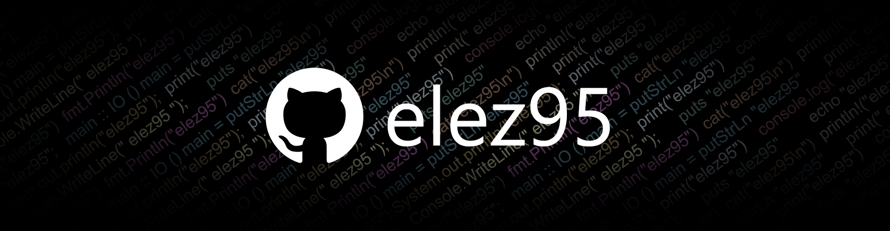
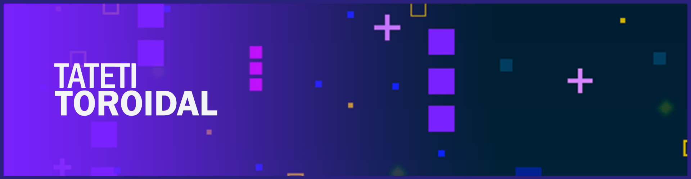
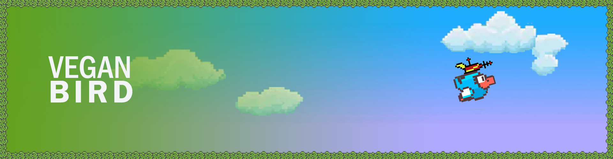
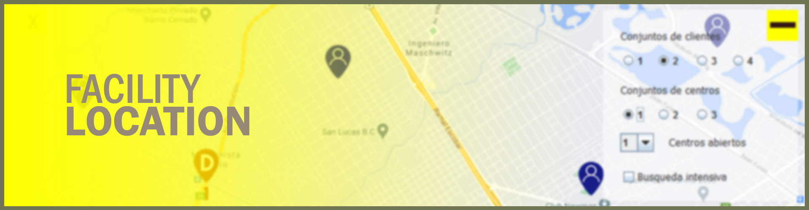
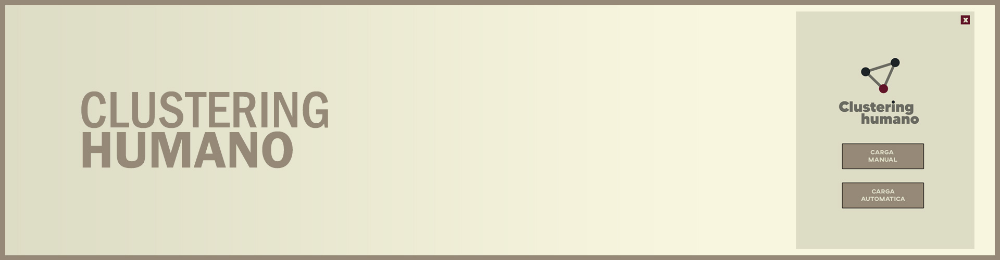

# ¡Hola mundo! Soy Elías 👋
### Programador Backend. Estudiante avanzado de la carrera Licenciatura en sistemas.

Estoy cursando mi tercer año de la carrera en la Universidad Nacional General Sarmiento. 

Mi interés por la informática nació desde pequeño, cuando la curiosidad me hacía desarmar aparatos eléctronicos (juguetes o electrodomésticos) para saber cómo funcionaban por dentro. Esa misma curiosidad se trasladó a la computación, del lado del software mayormente. Necesitaba responder cómo es posible que con algunos circuitos y cables se puede proyectar una imagen funcional en la pantalla. Todo esto me empujó a buscar respuestas, a entender el detrás de las aplicaciones y la computación.

Durante este trayecto universitario he disfrutado de muchas materias que despertaron aún más mi interés por la informática. También pude encontrar respuestas a muchas preguntas que tenía, y lo logré aprendiendo los siguientes conceptos: 
- La organización de una computadora y su funcionamiento desde el núcleo hasta los periféricos, pasando por compuertas lógicas, scheduler, semáforos, direccionamiento de memoria.
- Los distintos lenguajes de programción de bajo y alto nivel como C, x86 assembly, Java, Python, Javascript. Bases de datos con MySQL, PostgreSQL.
- La planificación de un proyecto a partir de la ingeniería del software, partiendo de:
  - Especificación del software: estudio de factibilidad, relevamiento, especificación y validación de requerimientos, documentación.
  - Diseño e implementación: diseño del modelo arquitectónico, diseño de la interfaz y componentes, diseño de la base de datos.
  - Validación del software: Pruebas de desarrollo, del sistema y de aceptación.
- Herramientas de diseño y testing como diagramas UML, testing unitario, testing automatizado, casos de uso, casos de prueba.
- Análisis y resolución de problemas, organización de tiempos de entrega y administración de responsabilidades.

A continuación te mostraré algunos proyectos que he realizado en donde pongo en práctica todos los conceptos que he visto, explicándote la experiencia ganada y los conociemientos adquiridos durante el desarrollo del mismo.

# Mis proyectos

## Tateti Toroidal

## Vegan Bird

## Facility Location

## Clustering Humano

## Portal Artesanos

<!--
**elez95/elez95** is a ✨ _special_ ✨ repository because its `README.md` (this file) appears on your GitHub profile.

Here are some ideas to get you started:

- 🔭 I’m currently working on ...
- 🌱 I’m currently learning ...
- 👯 I’m looking to collaborate on ...
- 🤔 I’m looking for help with ...
- 💬 Ask me about ...
- 📫 How to reach me: ...
- 😄 Pronouns: ...
- ⚡ Fun fact: ...
-->
